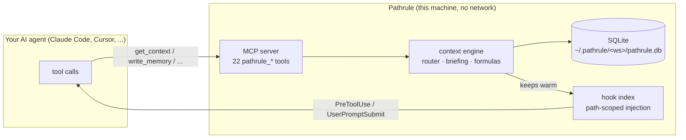

<p align="center">
  
</p>

<p align="center"><strong>The context layer for AI coding agents.</strong><br/>Path-scoped, just-in-time memory, rules, and skills. Fully local. No account. Zero infrastructure.</p>

<p align="center">
  <a href="#-quickstart">Quickstart</a> &nbsp;·&nbsp;
  <a href="#-how-it-works">How it works</a> &nbsp;·&nbsp;
  <a href="#-editions">Editions</a> &nbsp;·&nbsp;
  <a href="https://pathrule.io">Pathrule Cloud</a>
</p>

<p align="center">
  <a href="LICENSE"></a>
  <a href="https://github.com/pathrule/core/actions/workflows/ci.yml"></a>
  <a href="https://www.npmjs.com/package/@pathrule/cli"></a>
  = 20">
  
</p>

<p align="center">
  Works with <strong>Claude Code</strong>, <strong>GitHub Copilot</strong>, <strong>Cursor</strong>, <strong>Codex</strong>, <strong>Windsurf</strong>, and any MCP client.
</p>

---

Your AI agent forgets everything between sessions. The usual fixes are blunt: one giant
`CLAUDE.md` pasted into every conversation, or a memory dump the agent has to wade through.
Pathrule is the [context layer for AI coding](https://pathrule.io/ai-coding-context-layer): it
organizes the agent's knowledge **the way your repo is organized**.

Memories, rules, and skills attach to **paths**. When the agent works in `/apps/api`, it gets
exactly the context that belongs to `/apps/api`, injected just-in-time into every tool call,
automatically, without you pasting anything.

```text
/                      ← "We deploy with the release gate; never push to main directly"
├── apps/api           ← "Auth tokens rotate via the JWT refresh flow in auth/session.ts"
│   └── handlers/      ← "Webhook handlers must be idempotent (see the Stripe retry incident)"
└── packages/ui        ← rule: "Components use the design tokens, never raw hex values"
```

This repository is Pathrule's **open core** (Apache-2.0): the 22-tool MCP surface, the
path-scoped context engine, and an embedded SQLite backend that runs the entire loop with zero
infrastructure. No Docker, no Postgres, no login, no network.

## ⚡ Quickstart

Sixty seconds, no account:

```bash
npm i -g @pathrule/cli
cd your-project
pathrule init --local     # local SQLite store at ~/.pathrule/<workspace>/  (no signup)
pathrule setup --local    # wires your AI client's MCP config + hooks       (no signup)
```

Restart your AI tool. That is the whole setup. From now on:

- the agent **writes** what it learns with `pathrule_write_memory`, `pathrule_write_rule`, and
  `pathrule_write_skill`. Writes are path-first; missing nodes auto-create.
- the agent **reads** just-in-time: `pathrule_get_context` routes its intent and assembles a
  depth-appropriate briefing.
- **hooks** inject path-scoped reminders into every tool call, with no daemon and no network.
- everything lands in a SQLite file **you own**.

Browse what your agent knows, from the terminal:

```bash
pathrule memory list --local
pathrule rule list --local
pathrule search "deploy" --local
```

> **Does the CLI need an account?** No. Local mode is complete and account-free; what you just
> installed runs 100% offline. An account only exists for [Pathrule Cloud](#-editions),
> the paid team edition. Until you log in, no cloud code path is ever taken.

### 🧩 Prefer the editor? Install the VSCode extension

[**Pathrule for VSCode**](https://marketplace.visualstudio.com/items?itemName=Pathrule.pathrule-vscode)
ships the same local engine inside the editor, still account-free:

- a **knowledge map** sidebar that follows your active file and shows exactly what your agent
  receives on each path, with count badges in the Explorer;
- memories, rules and skills open as **markdown tabs** (save persists, conflicts are never silent);
- right-click any file or folder → **Pathrule** → browse the knowledge an AI session there
  would receive, or scope a new memory/rule/skill in two keystrokes;
- **Connect AI Clients**: GitHub Copilot agent mode registers automatically; Claude Code,
  Cursor, Codex, Windsurf and the Copilot CLI get managed MCP entries plus context hooks
  (Copilot reads them from `.github/hooks/`), no JSON editing;
- works on the same `~/.pathrule` store as the CLI: one identity, one knowledge base.

Also on [Open VSX](https://open-vsx.org/extension/pathrule/pathrule-vscode) for Cursor and Windsurf.

## 🧠 How it works



- **Path-first writes.** Content attaches to workspace-relative paths (`/apps/api`,
  `/packages/ui`). Missing nodes auto-create, so the knowledge tree mirrors your repo with zero
  ceremony.
- **Just-in-time context, not context dumps.** `pathrule_get_context` classifies the agent's
  intent with a deterministic, fully local router and returns a _depth-appropriate_ response:
  minimal for a quick edit, a full research briefing for debugging. The deep mode composes real
  retrieval formulas: subtree memory index, fuzzy project-map search, co-change coupling
  (derived from the agent's own activity log), prior solutions, and work-episode clustering.
- **Hooks close the loop.** A local hook index is kept warm so your client's
  PreToolUse / PostToolUse / UserPromptSubmit hooks inject relevant titles and rules for the
  exact path being touched. The agent is reminded _before_ it acts, not after it fails.
- **SQLite is the source of truth.** WAL mode, `0600` permissions, one file per workspace. It is
  not a cache of any cloud; in this edition there is no cloud.

## 🔑 Optional bring-your-own-key intelligence

Everything above works with **zero keys and zero network**. Two optional upgrades if you bring
your own API key (you pay your provider directly, and keys never leave your machine except to
call that provider):

| Env var | Enables | Without it |
| --- | --- | --- |
| `PATHRULE_AI_ROUTE_KEY` (Anthropic) | LLM intent routing for sharper context-depth selection | deterministic router (default, instant) |
| `PATHRULE_EMBEDDING_PROVIDER` = `voyage` \| `openai` + `PATHRULE_EMBEDDING_API_KEY` | Semantic relevance, two places: (1) `get_context` memory search, and (2) the hooks — each prompt is embedded and the most relevant memory/skill bodies are ranked and injected just-in-time. Embeddings are computed on write and stored locally; only the prompt is embedded at runtime. | lexical + path-scoped retrieval (hooks still inject, ranked by keyword overlap instead of meaning) |

Both degrade gracefully. On timeout or a missing key, Pathrule falls back to the deterministic
path, the same fallback discipline the cloud edition uses. The embedding key is what turns the
hooks from "inject the path's titles" into "inject the few bodies this prompt actually needs," so
it is the highest-leverage key for context quality and token cost.

## 🏷 Editions

Pathrule is an **open-core** product, and we try to be precise about what that means.
Everything in this repository is free; pricing only ever applies to the hosted product.

| | **Pathrule Core** (this repo) | **Self-Hosted** (enterprise) | **Pathrule Cloud** |
| --- | --- | --- | --- |
| Best for | Solo work, fully local | Teams that keep data inside their own boundary | Zero-ops team knowledge |
| Setup | `npm i -g @pathrule/cli`<br/>`pathrule init --local` | Signed images, Docker Compose ([talk to sales](mailto:hello@pathrule.io)) | Sign up at [pathrule.io](https://pathrule.io) |
| Account | **none, fully offline** | your own SSO (SAML / OIDC) | required |
| Storage | local SQLite you own | your database, on your infra | managed backend |
| Knowledge layer: path-scoped memories/rules/skills, 22 MCP tools, get_context engine, hooks | ✅ | ✅ | ✅ (same core, literally this package) |
| Semantic search + LLM routing | bring your own key | your key or hosted proxy | managed, no keys needed |
| Team sync, live activity, AI curation | ✗ | ✅ on your infra | ✅ |
| Web + desktop GUI | ✗ | ✅ | ✅ |
| Price / license | **free**, Apache-2.0 | commercial license | [plans](https://pathrule.io/pricing) with a free Solo tier |

Just you, on your machine? **Core is the whole product.** A team that cannot let data leave its
boundary? **Self-Hosted.** Zero ops? **Pathrule Cloud.**

The published `@pathrule/cli` is one binary with both halves. **Local mode (this open core) needs
no account**; logging in switches the same CLI onto the cloud backend. The AI client sees an
identical MCP tool contract either way: a cross-edition parity suite in our release gate locks
the response shapes, and a mechanical export-set guard ensures this repo never contains cloud
code or credentials. The cloud edition starts to matter when a second person joins your project.

## 🔒 Privacy

The local edition makes **no network calls** except to the bring-your-own-key providers you
explicitly configure. No telemetry, no account, no sync. The open-source code paths contain no
telemetry code at all (you can audit that here). Your knowledge lives in a SQLite file on your
disk.

## 📦 Repository layout

| Package | What |
| --- | --- |
| [`packages/core`](packages/core) | `@pathrule/core`: the `KnowledgeBackend` seam, the embedded SQLite `LocalBackend`, an in-memory reference backend, the context formulas (subtree index, project-map ranking, co-change, work episodes, briefing, hook index), and the bring-your-own-key adapters |
| [`packages/shared`](packages/shared) | shared contracts and pure helpers (types, path helpers, hook protocol, MCP client-config installers) |
| [`packages/cli-local`](packages/cli-local) | the open local command modules of the Pathrule CLI (`init --local`, `setup --local`, local content browsing, offline hook wiring) |

This tree is synced one-way from our monorepo, and it is **real, buildable source**, not a code
drop: `pnpm install && pnpm typecheck && pnpm test` passes standalone, and CI runs it on every
push.

## 🧪 Development

```bash
pnpm install     # Node >= 20, pnpm 9 (corepack enable)
pnpm typecheck
pnpm test        # KnowledgeBackend contract suite (in-memory vs SQLite parity) + CLI module tests
```

The contract suite (`packages/core/src/backend/contract-suite.ts`) runs identical assertions
against the in-memory reference and the real SQLite backend. If they diverge, it fails. That is
the backbone: new backend behavior belongs there.

## 🤝 Contributing

PRs to core ship in the product: every Pathrule edition consumes this same package, so a fix here
reaches everyone. See [CONTRIBUTING.md](CONTRIBUTING.md). In short: DCO sign-off (`git commit -s`),
no CLA, deterministic by default, and contract-test what you change. Please also read our
[Code of Conduct](CODE_OF_CONDUCT.md).

## ⚖️ License

[Apache-2.0](LICENSE)
